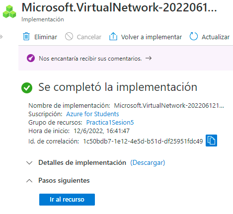
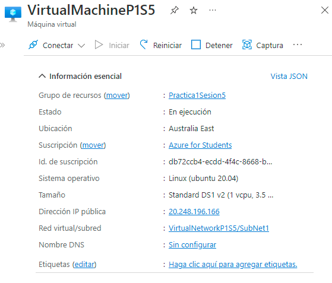
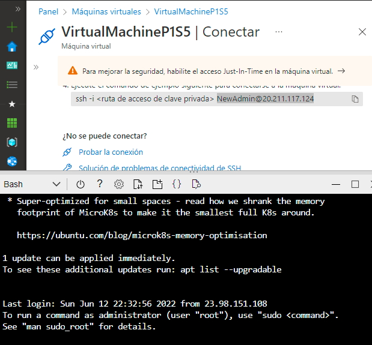
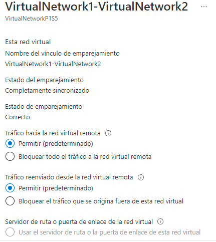
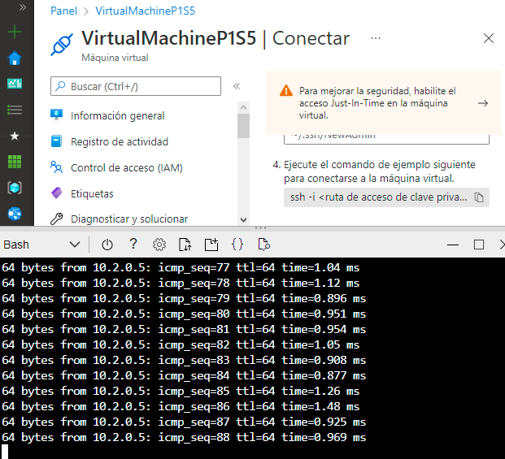

# Practica 1 Sesion 5
Implementación de los Azure Network Services al crear una conección entre 2 máquinas virtuale, cada una con su respectiva red enlazada entre sí.

#
Procedimiento:
-
1. Generar un grupo de recursos.
2. Crerar 2 redes virtuales (red1 y red2) en el apartado de Virtual Networks, cada una deberá tener una sub red (subred1 y subred 2) y ambas redes se deberán agregar al mismo grupo de recursos previamente creado.

3. Posterior a eso se deberán crear 2 Virtual Machines las cuáles se deben generar conn autenticación que requiera de un user y un password. Estas máquinas virtuales deberán tener la misma region que las redes antes generadas. Dentro del área de creación de Virtual Machines nos vamos al apartado de redes y asignamos una red a cada una, en este caso, VM1 a VN1 así como VM2 a VN2 y procederemos a verificar y crear.

4. Ya una vez creados estos recuros nos iremos a la primera máquina virtual y nos conectaremos mediante SSH, esto nos mostrara una página en la cual nos iremos a la zona que dice ssh -i <("ruta de acceso de clave privada")> y copiaremos el usuario generado que esta continuo a este script.
    * Nota: este username fue el cual creaste al hacer la máquina virtual así como el password.

5. Después abriremos la consola de comandos de Azure Cloud Shell y mediante el tipo de consola Bash comprobaremos las credenciales iniciando sesión como [ssh "usarname"]  y damos enter y nos pedirá el password.

6. Habiendo hecho esto, conectaremos las 2 redes virtuales previamente creads yendonos en este caso a cualquiera de las 2, en este caso lo hicimos en la segunda red virtual y nos iremos al apartado de emparejamientos y crearemos uno nuevo. Ahí mismo llenamos los datos que nos pidemos y crearmos el emparejamiento de amabas redes.

7. Finalemente comprobaremos el emparejamiento yendonos a cualquiera de las redes y en el área de dispositivos conectados del lado izquierdo, copiaremos la dirección IP mmostrada y nos iremos a cualquier máquina virtual. Dentro de esta abriremos la consola de comandos explicada anteriormente, iniciamos sesión y escribiremos el comando ping "Dirección IP copiada" y nos mostrara todo el historial de intercambio entre ambas redes comprobando así la comunicación entre las redes de ambas máquinas virtuales.

#
Autor: Rogelio Clemente Balderas
-

Requisitos:
-
- Cuenta y sucripción en Azure.
- Azure Virtual Network Services.
- Azure Virtual Machines Services.
#